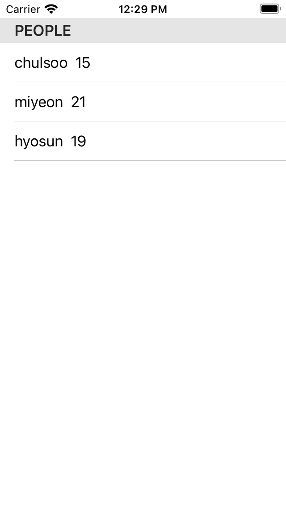

# List

## ForEach를 이용한 리스트 구성

리스트에 나타날 데이터 정보와 데이터 표현 방법을 입력 받아 리스트를 구성한다. 다음의 세 가지 ForEach 중 하나를 통해 간단한 리스트를 구성할 수 있다.

### ForEach(data:, contents:)

`data`가 `Identifiable`할 때 사용 가능. <br>
(`Identifiable`: 생성된 객체의 identifier 부여 요구)

```swift
struct Info: Identifiable {
	var id = UUID() // Identifiable
    var name: String = ""
    var age: Int = 0
}
// 데이터 모델

struct ContentView: View {
    @State private var data = [
        Info(name: "chulsoo", age: 15),
        Info(name: "miyeon", age: 21),
        Info(name: "hyosun", age: 19)
    ]
    var body: some View {
        List {
            ForEach(data) { info in
                HStack {
                    Text(info.name)
                    Text(String(info.age))
                }
            }
        }
        
    }
}
```
<br>
<br>

### ForEach(data: Range<Int>, contents:)

리스트에 들어갈 데이터의 범위를 입력하여 데이터의 순서를 구분함

```swift
struct Info {
    var name: String = ""
    var age: Int = 0
}

struct ContentView: View {
    @State private var data = [
        Info(name: "chulsoo", age: 15),
        Info(name: "miyeon", age: 21),
        Info(name: "hyosun", age: 19)
    ]
    var body: some View {
        List {
            ForEach(0 ..< data.count) { index in
                HStack {
                    Text(data[index].name)
                    Text(String(data[index].age))
                }
            }
        }
        
    }
}
```
<br>
<br>

### ForEach(data: id: contents:)

`data`가 `Hashable`을 상속할 때 사용 가능.<br> 
(`Hashable`: 새로운 객체를 생성할 때마다 해당 객체의 해시 값이 부여됨.)

```swift
struct Info: Hashable {
    var name: String = ""
    var age: Int = 0
}

struct ContentView: View {
    @State private var data = [
        Info(name: "chulsoo", age: 15),
        Info(name: "miyeon", age: 21),
        Info(name: "hyosun", age: 19)
    ]
    var body: some View {
        List {
            ForEach(data, id: \.self) { info in
                HStack{
                    Text(info.name)
                    Text(String(info.age))
                }
            }

        }
        
    }
}

```
<br>
<br>
<br>

## Section을 이용한 리스트 구성

### 사용 예시

```swift
struct Info: Identifiable {
    var id = UUID()
    var name: String = ""
    var age: Int = 0
}

struct ContentView: View {
    
    @State private var data = [
        Info(name: "chulsoo", age: 15),
        Info(name: "miyeon", age: 21),
        Info(name: "hyosun", age: 19)
    ]
    
    var body: some View {
        List {
            Section(header: Text("People")) {
                ForEach(data) { person in
                    HStack {
                        Text(person.name)
                        Text("\(person.age)")
                    }
                }
            }
            
        }
    }
}
```

<div style="text-align: center;">
    
</div>
<br>
<br>
<br>

## 참고

- [Apple Developer Documentation - List](https://developer.apple.com/documentation/swiftui/list)
- [Hohyeon Moon님 Youtube](https://youtu.be/m6n0mgtDPIo)