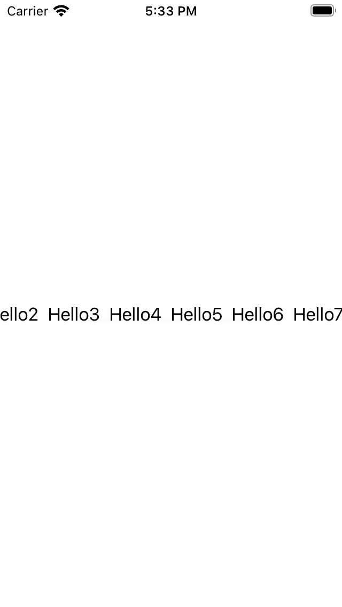
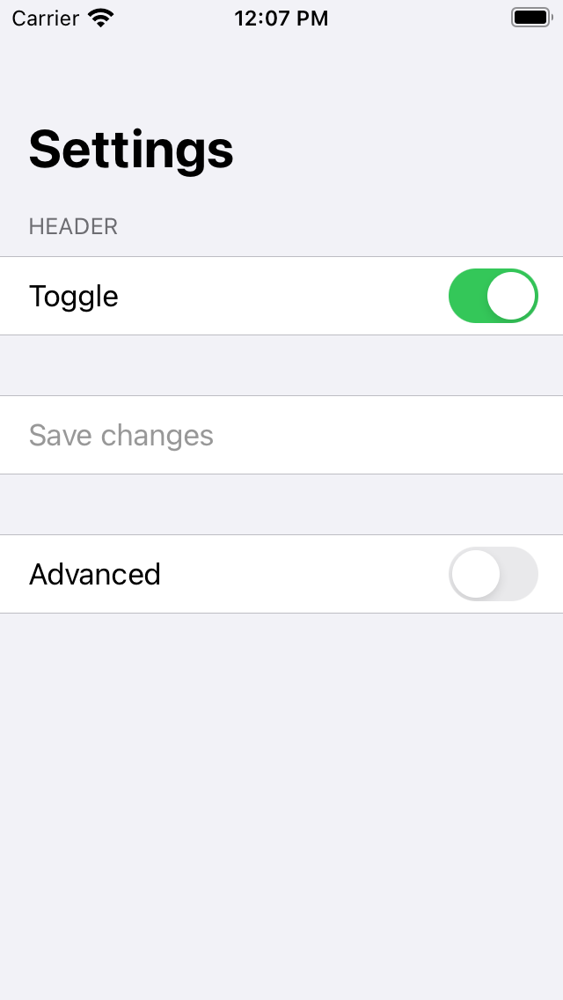

# Form & ScrollView

## ScrollView

```swift
ScrollView(_ axes:, showsIndicators:, contents:)
```
`axes`를 통해 스크롤 방향을 지정할 수 있고, `showsIndicators`를 통해 스크롤 바 화면 표시 여부를 지정할 수 있다.

```swift
ScrollView(.horizontal, showsIndicators: true) {
    HStack {
        Text("Hello")
        Text("Hello1")
        Text("Hello2")
        Text("Hello3")
        Text("Hello4")
        Text("Hello5")
        Text("Hello6")
        Text("Hello7")
        Text("Hello8")
        Text("Hello9")
    }
}
```
<div style="text-align: center;">
	
</div>

## Form

설정 화면과 같이 데이터 엔트리를 위한 컨트롤러를 그룹핑한 컨테이너. Form 내부에 여러 뷰를 넣을 수 있다.<br>
제목 표기를 위해 주로 `NavigationView`와 함께 쓰인다.
```swift
struct ContentView: View {
    @State var showingAdvancedOptions = false
    var body: some View {
        NavigationView {
            Form {
                Toggle(isOn: $showingAdvancedOptions, label: {
                    Text("Toggle")
                })
                Button(action: {}, label: {
                    Text("Save changes")
                })

            }.navigationBarTitle(Text("Settings"))
        }
    }
}
```
<br>
<br>

Form의 섹션을 나누고 싶을 때는 `List`처럼 원하는 `Section`을 추가해주면 된다.
```swift
struct ContentView: View {
    @State var showingAdvancedOptions = false
    @State var toggling = false
    var body: some View {
        NavigationView {
            Form {
                Section(header: Text("header")) {
                    Toggle(isOn: $showingAdvancedOptions, label: {
                        Text("Toggle")
                    })
                }
                Section {
                    Button(action: {}, label: {
                        Text("Save changes")
                    }).disabled(!toggling)
                }

                if showingAdvancedOptions {
                    Toggle(isOn: $toggling) {
                        Text("Advanced")
                    }
                }

            }.navigationBarTitle(Text("Settings"))
        }
    }
}
```
<div style="text-align: center;">
    
</div>

## 참고

- [Apple Developer Documentation - ScrollView](https://developer.apple.com/documentation/swiftui/scrollview)
- [Apple Developer Documentation - Form](https://developer.apple.com/documentation/swiftui/form)
- [Hohyeon Moon님 블로그](https://www.hohyeonmoon.com/blog/swiftui-tutorial-form-scrollview/)