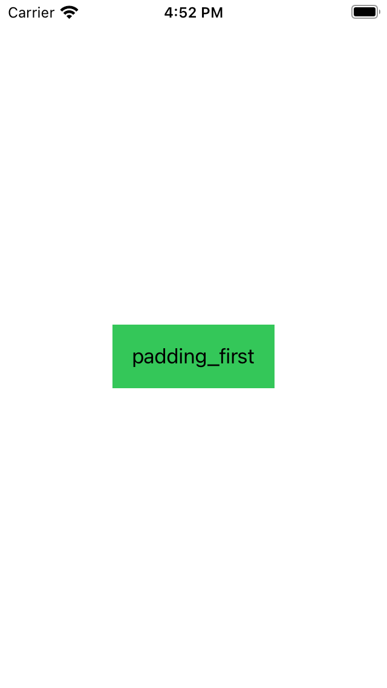
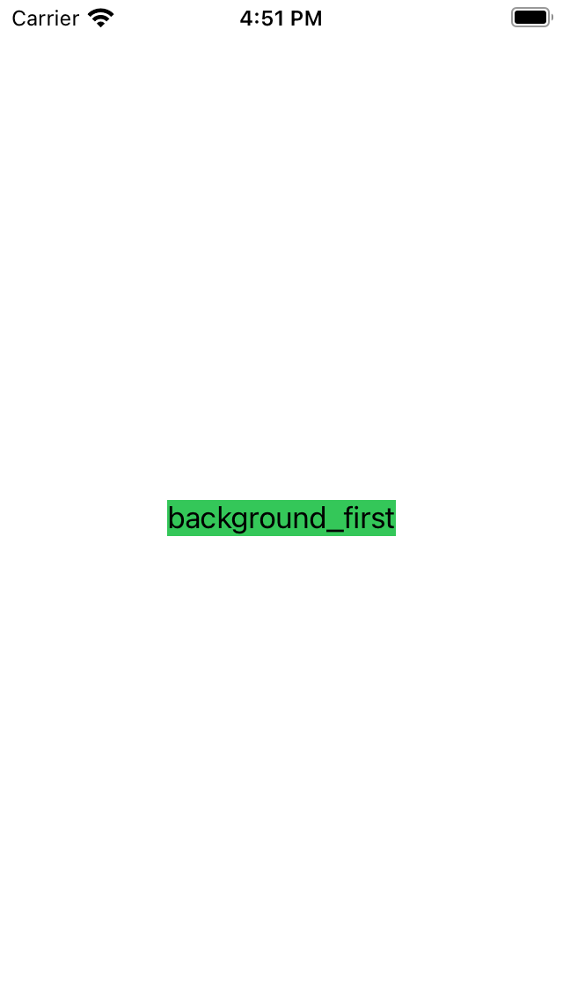

# SwiftUI Tutorial - Text, Image, Button, Stack

## Text

UIKit에서 `UILabel`과 같은 역할을 하는 read-only View로, 다양한 속성을 부여할 수 있다.

### 사용 예시

```swift
Text("Hello World")
```
<br>
<br>

### 주요 메서드

- `multilineTextAlignment(_:)`: 텍스트 정렬. `.leading`, `.center`, `.trailing`의 세가지 옵션이 있다.

- `padding()`: `EdgeInsets` 또는 직접 top, bottom, leading, trailing 값을 입력해 Text의 영역을 지정할 수 있다. (padding을 지정해주지 않을 땐 텍스트 길이만큼의 영역만 차지한다.)

- `foregroundColor(_:)`: 텍스트 색상 지정.

- `lineLimit(_:)`: 화면에 보이는 텍스트 라인 제한. 0일 때는 텍스트의 길이만큼 라인이 지정된다.

- `lineSpacing(_:)`: 텍스트 줄 간격 지정.

- `truncationMode(_:)`: 텍스트의 길이가 지정된 lineLimit을 넘어갈 때 생략되는 부분을 지정한다. `.head`, `.middle`, `.tail`의 세가지 옵션이 있다.
<br>
<br>

### 주의사항

Text에 메서드를 통해 속성을 부여할 때 순서 지정에 유의해야 한다.
```swift
Text("padding_first")
	.padding()
	.background(Color.green)
```

```swift
Text("background_first")
	.background(Color.green)
	.padding()
```

<div style="text-align: center;">
	
	
</div>
<br>
<br>
<br>

## 참고

- [Apple Developer Documentation - Text](https://developer.apple.com/documentation/swiftui/text)