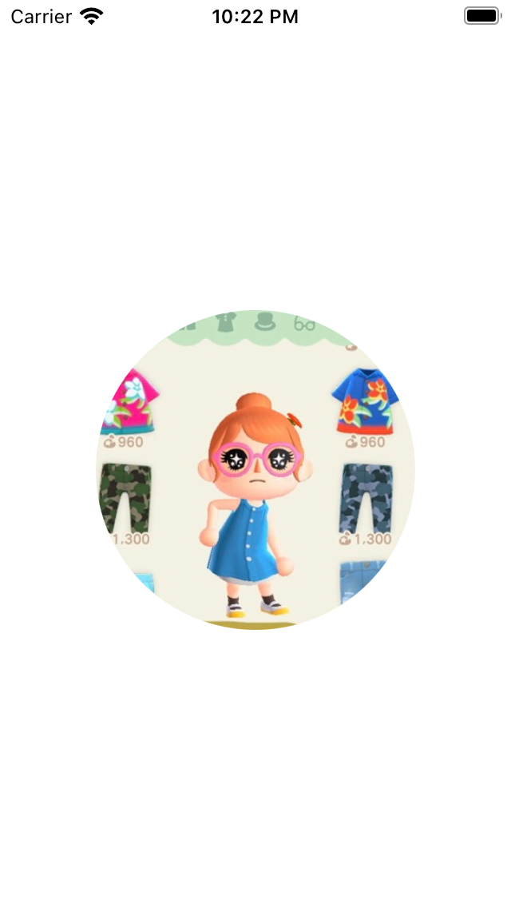
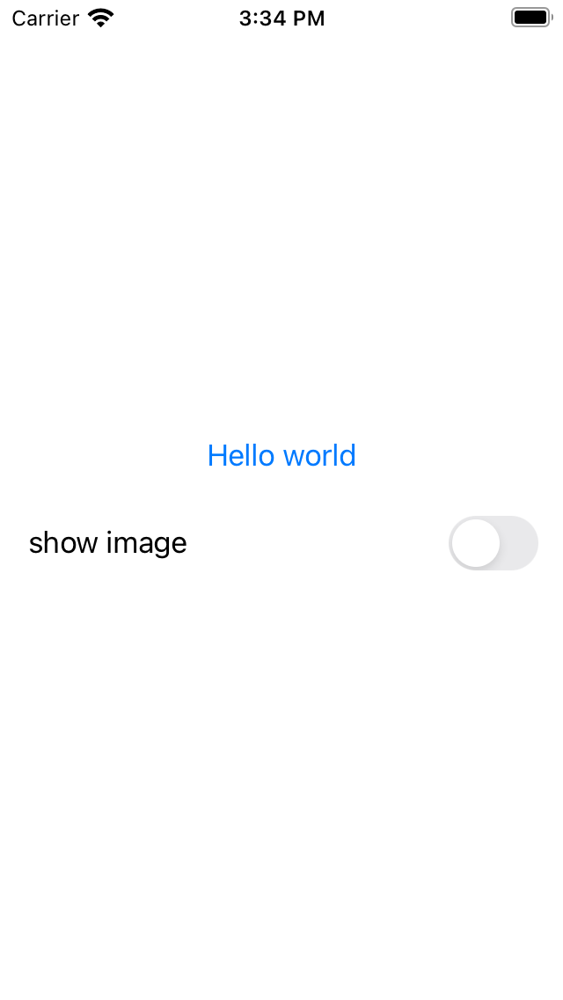
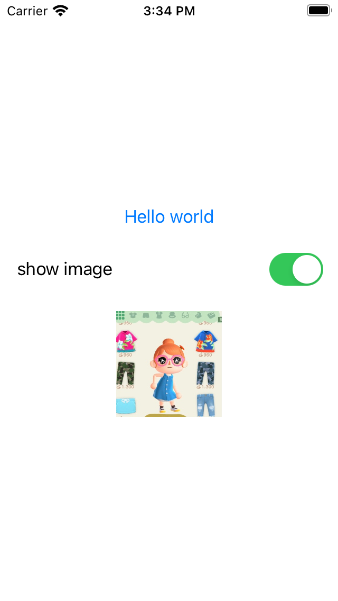

# SwiftUI Tutorial - Text, Image, Button, Stack

## Text

UIKit에서 `UILabel`과 같은 역할을 하는 read-only View로, 다양한 속성을 부여할 수 있다.

### 사용 예시

```swift
Text("Hello World")
```
<br>
<br>

### 주요 메서드

- `multilineTextAlignment(_:)`: 텍스트 정렬. `.leading`, `.center`, `.trailing`의 세가지 옵션이 있다.

- `padding()`: `EdgeInsets` 또는 직접 top, bottom, leading, trailing 값을 입력해 Text의 영역을 지정할 수 있다. (padding을 지정해주지 않을 땐 텍스트 길이만큼의 영역만 차지한다.)

- `foregroundColor(_:)`: 텍스트 색상 지정.

- `lineLimit(_:)`: 화면에 보이는 텍스트 라인 제한. 0일 때는 텍스트의 길이만큼 라인이 지정된다.

- `lineSpacing(_:)`: 텍스트 줄 간격 지정.

- `truncationMode(_:)`: 텍스트의 길이가 지정된 lineLimit을 넘어갈 때 생략되는 부분을 지정한다. `.head`, `.middle`, `.tail`의 세가지 옵션이 있다.
<br>
<br>

### 주의사항

Text에 메서드를 통해 속성을 부여할 때 순서 지정에 유의해야 한다.
```swift
Text("padding_first")
	.padding()
	.background(Color.green)
```

```swift
Text("background_first")
	.background(Color.green)
	.padding()
```

<div style="text-align: center;">
	
	
</div>
<br>
<br>
<br>

## Image

UIKit의 `UIImageView`와 같은 역할을 하는 View. `UIImage`를 이니셜라이징 할 때처럼 사용 가능하다.

### 사용 예시

```swift
Image(systemName: "heart.fill")

Image("sampleImage.png")

Image(uiImage: UIImage(named: "MyImage"))
```
<br>
<br>

### 주요 메서드

- `resizable()`: 이미지 크기 조절을 위한 메서드.

- `aspectRatio(contentMode:)`: 정해진 사이즈에 이미지를 채우는 방법 지정. `.fill`, `.fit` 2가지의 옵션이 있다.

- `edgesIgnoringSafeArea(_:)`: safe area를 벗어나는 영역에 이미지를 배치하거나 safe area를 넘어서는 영역까지 이미지의 크기를 늘릴 때 사용하는 메서드. `.all` 을 통해 SuperView까지 이미지의 영역을 넓힐 수 있다.

- `mask()`: 이미지 마스킹 메서드. 프로그래머가 원하는 형태로 이미지를 마스킹할 수 있다.
```swift
Image("sample")
    .resizable()
    .aspectRatio(contentMode: .fill)
    .frame(width: 200, height: 200, alignment: .center)
    .mask(
        Circle()
    )
```
<div style="text-align: center;">
	
</div>

<br>
<br>
<br>

## Button, Toggle

각각 UIKit의 `UIButton`, `UISwitch`와 같은 역할을 하는 제어 뷰.

### 사용 예시

```swift
@State var isHidden = false
// 중략

Button(action: {
	// action
	isHidden.toggle()
}, label: {
	// display
	Text("Hello world")
})

Toggle(isOn: $isHidden, label: {
	Text("show image")
})
```
<div>
	
	
</div>
<br>
<br>
<br>

## 참고

- [Apple Developer Documentation - Text](https://developer.apple.com/documentation/swiftui/text)
- [Apple Developer Documentation - Image](https://developer.apple.com/documentation/swiftui/image)
- [Apple Developer Documentation - Button](https://developer.apple.com/documentation/swiftui/button)
- [Apple Developer Documentation - Toggle](https://developer.apple.com/documentation/swiftui/toggle)