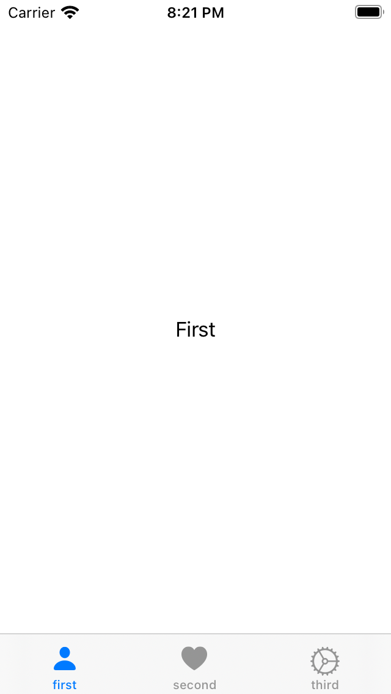
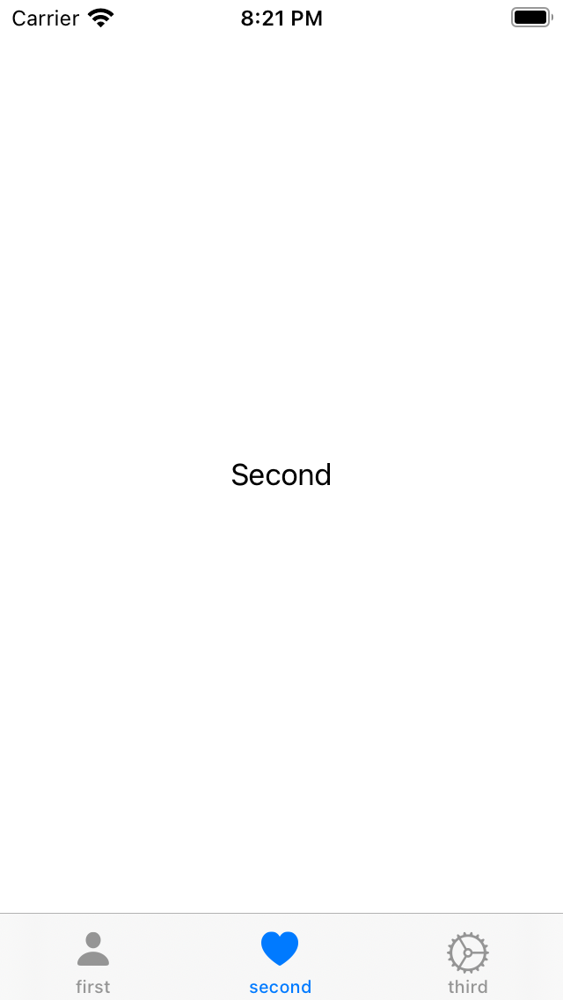
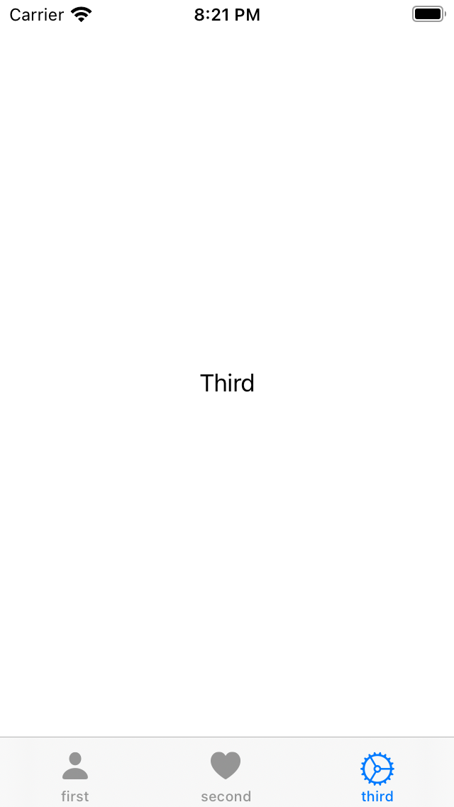

# TabView

여러 자식뷰들 사이의 전환을 돕는 뷰. Swift의 UITabViewController와 같은 역할을 한다. 

```swift
struct ContentView: View {
    var body: some View {
        TabView {
            Text("First") //Text 대신 새로운 ContentView를 넣을 수도 있다.
                .tabItem {
                    Image(systemName: "person.fill")
                    Text("first")
                }
            Text("Second")
                .tabItem {
                    Image(systemName: "heart.fill")
                    Text("second")
                }
            Text("Third")
                .tabItem {
                    Image(systemName: "gear")
                    Text("third")
                }
        }
    }
}
```

<div style="text-align: center;">
  
  
  
</div>

<br><br>

## 참고

- [Apple Developer Documentation - TabView](https://developer.apple.com/documentation/swiftui/tabview)
- [SwiftUI - iOS14 퍼펙트 가이드](https://www.inflearn.com/course/swift-ui-ios14/dashboard)
- [SwiftUI TabView 사용하기](https://www.hohyeonmoon.com/blog/swiftui-tutorial-tab-view/)

