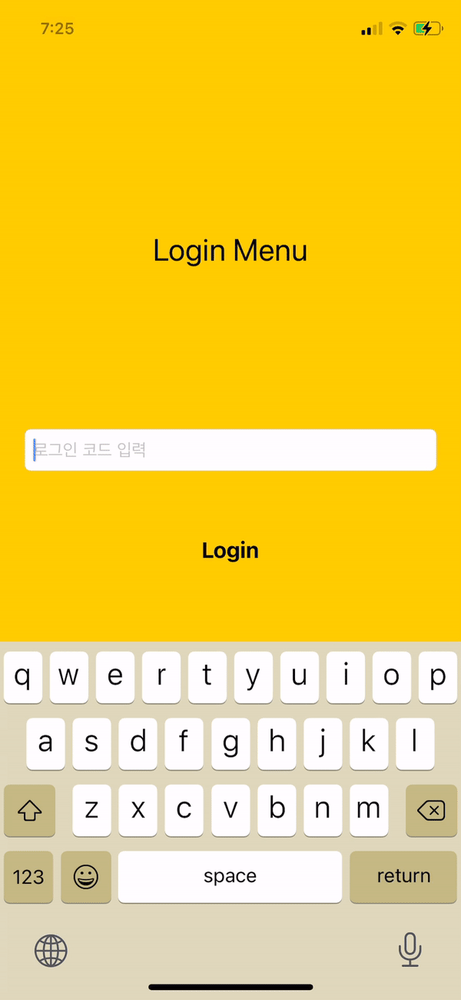
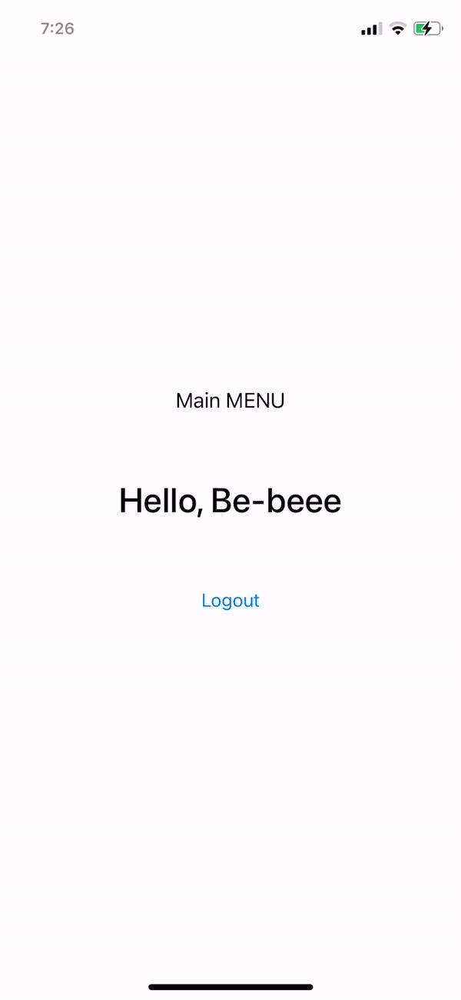
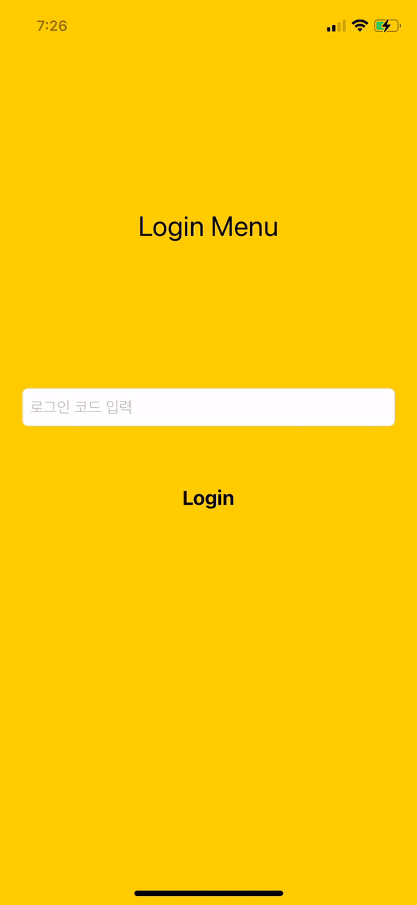

# LoginPage Configuration

로그인 화면에서 메인 화면, 메인 화면에서 로그인 화면으로의 페이지 이동에 대해 다루었다.<br>
로그인 코드 텍스트 필드에 `Be-beee`를 입력하면 메인 화면으로 이동된다.<br>
<br>

## 구현

핵심은 ViewController LifeCycle의 `viewDidAppear()` 메서드를 활용하는 것. 애플리케이션이 로그인 정보를 가지고 있지 않는 최초 실행 상태 또는 로그아웃한 상태일 때 메인 화면을 기반으로 로그인 화면을 modal 형태의 fullScreen으로 띄운다. <br>
<br>
```swift
override func viewDidAppear(_ animated: Bool) {
    super.viewDidAppear(animated)
    if UserDefaults.standard.string(forKey: "loginData") == nil {
        guard let loginVC = UIStoryboard(name: "LoginMenuController", bundle: nil).instantiateViewController(withIdentifier: "loginVC") as? LoginMenuController else { return }
        loginVC.modalPresentationStyle = .fullScreen
        self.present(loginVC, animated: false, completion: nil)
    } else {
        mainLabel.text = "Hello, "+UserDefaults.standard.string(forKey: "loginData")!
    }
}
```
`viewDidLoad()`, `viewWillAppear()`상태에서는 애플리케이션의 뷰가 아직 화면에 나타나지 않았으므로 메인 화면이라는 기반이 없어 로그인 화면이 나타나지 못한다. 뷰가 화면에 완전히 띄워진 직후 실행되는 메서드인 `viewDidAppear()`에서 `present(_:animated:completion:)` 메서드를 작성한 이유이다.
<br>
<br>

## 실행 화면

<div style="text-align: center;">
	
	
	
</div>