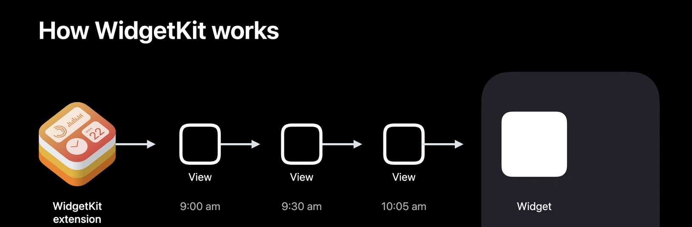
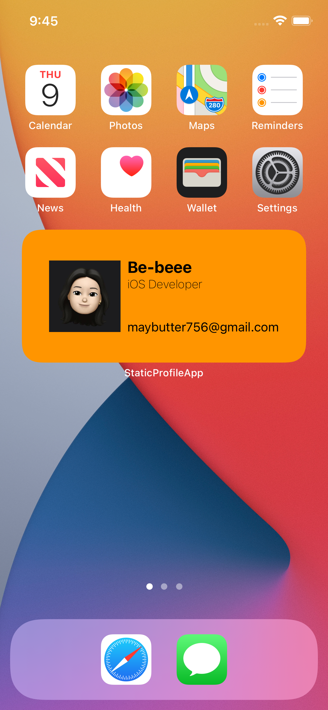
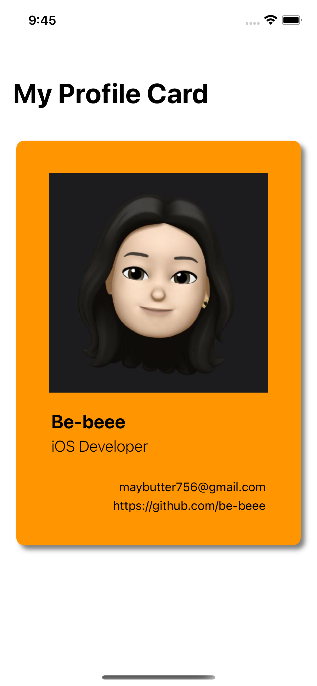

# Simple Widget Guide

    

 
Static Widget/Dynamic Widget은 `TimelineProvider`에서 지정한 시간 옵션에 따라 `TimelineEntry`를 업데이트하는 방식으로 동작한다. 
타임라인은 `getTimeline` 메서드에서 array 형식으로 얻어오고, `getSnapshot` 메서드를 통해 특정 시간에 맞는 `TimelineEntry`를 가져오게 된다.

 
 

## Static Widget

	
	

위젯 편집 기능이 포함되지 않은 정적(Static) 위젯.  
 
 

## Dynamic Widget

작성 예정.
 
 

## References

- [Meet WidgetKit](https://developer.apple.com/videos/play/wwdc2020/10028/)
- [Making a Configurable Widget](https://developer.apple.com/documentation/widgetkit/making-a-configurable-widget)
